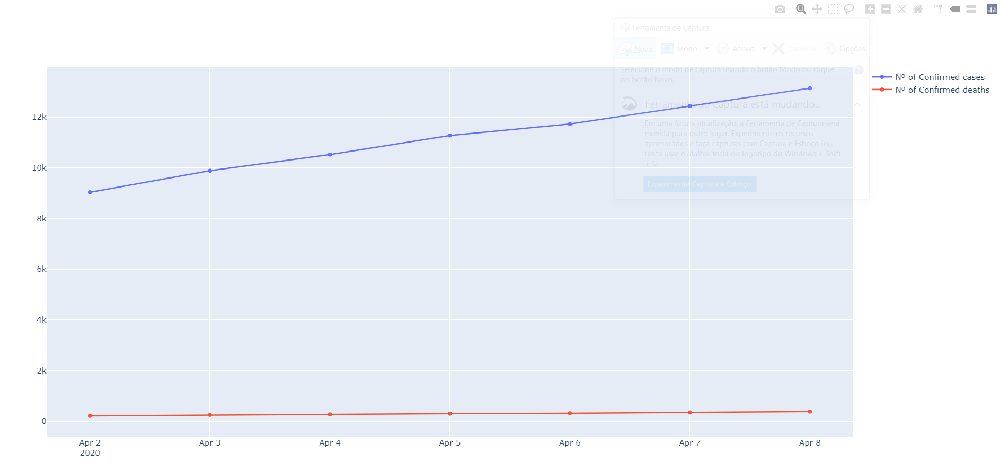
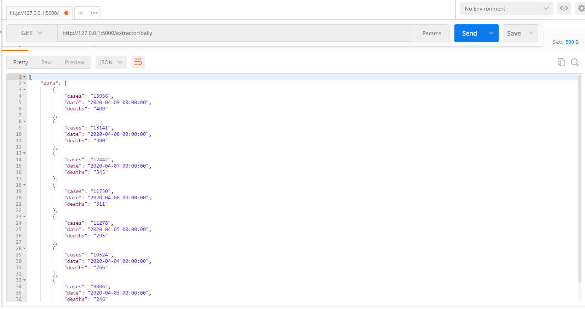

# COVID-19 Portugal Data
Basic spider to extract data about the COVID-19 situation in Portugal.

## How it works
The extraction works reading the html of the the official website and
getting the data from the pdfs that are update every day.
Link: https://covid19.min-saude.pt/relatorio-de-situacao/

## App Usage
First, create your own virtual enviroment with venv, install
all the libraries with:

`pip install -r requiments.txt`

To run the app, enter with the following command:

`scrapy runspider spiders/dgs_spider.py`

**NOTE:** After the crawler finished a folder called **results** will be created and contais
the data in json format.

Once you have the result.json file, you can access the rest api by
using the browser with the link below:

First, start the configure the flask server:

WINDOWS:
`set FLASK_APP=api/app.py`

LINUX, MAC:

`export FLASK_APP=api/app.py`

Run Flask server:

`flask run`

Link:

[text](https://127.0.0.1:5000/extractor/daily)

## Sample Result Plotly Chart:
**Last 7(seven) days** 

## Sample Result Json:
**Last 7(seven) days** 

